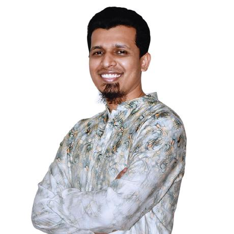

# K. M. Sazzad Hossain

### Backend Software Engineer | AWS & Azure Certified | Cloud, DevOps and Platform Engineering

## 👋 Assalamu'alaikum Warahmatullahi Wabarakatuh

I am a **Senior Software Engineer** with more than seven years of experience developing, deploying, and supporting enterprise applications.

My core background is in **backend engineering with PHP, Laravel, databases, REST APIs, and system integration**. Alongside software development, I have gained hands-on experience in **Linux administration, virtual-machine management, cloud infrastructure, CI/CD pipelines, monitoring, automation, and production support**.

I am currently strengthening my expertise in **Cloud, DevOps, Platform Engineering, and Infrastructure Automation**, with a focus on building reliable, scalable, secure, and highly available systems.

---

## 🚀 What I Do

* Design and develop scalable backend applications and REST APIs
* Manage Linux servers, virtual machines, application services, and deployments
* Support and troubleshoot CI/CD pipelines using Jenkins and GitLab
* Automate repetitive infrastructure and reporting tasks
* Optimize database queries and application performance
* Monitor systems using Grafana, PRTG, and cloud-monitoring services
* Integrate payment gateways, SMS services, authentication systems, and third-party APIs
* Collaborate with developers, QA engineers, infrastructure teams, and business stakeholders

---

## 🏆 Professional Highlights

* Supported infrastructure operations across **38+ virtual machines and physical servers**
* Contributed to maintaining approximately **99.99% service availability**
* Automated previously manual PRTG reporting processes using Python
* Contributed to enterprise platforms including **Workflow, BroadSight, SCM, Inventory, HRIS, CRM, CPORTAL, ITM, and mobile applications**
* Supported application deployments, production troubleshooting, incident recovery, and release readiness
* Worked with AI-powered image search, backend APIs, and application-service integrations

---

## 🛠️ Technical Skills

### Cloud and Infrastructure

### DevOps and Automation

### Backend Development

### Databases and Caching

### Mobile and Frontend

### Monitoring and Observability

---

## 🎓 Certifications

* **AWS Certified Solutions Architect – Associate  (SAA-C03)**
* **Microsoft Certified: Azure Administrator Associate — AZ-104**
* **Microsoft Certified: Azure Solutions Architect Expert — AZ-305**
* **Microsoft Certified: DevOps Engineer Expert — AZ-400**

---

## 🌱 Currently Learning and Building

* Containerization with Docker
* Kubernetes administration and application deployment
* Infrastructure as Code with Terraform
* CI/CD pipeline design and automation
* Zero-downtime deployment strategies
* Cloud architecture, security, scalability, and disaster recovery
* Infrastructure monitoring and observability
* Highly available applications across AWS and Azure

---

## 🎯 Career Direction

I am working toward a full-time role in:

* DevOps Engineering
* Cloud Engineering
* Platform Engineering
* Infrastructure Engineering
* Site Reliability Engineering

I am particularly interested in opportunities where I can combine my **software-development background** with **cloud infrastructure, automation, deployment engineering, and production reliability**.

---

## 🤝 Let's Connect

I enjoy connecting with professionals working in **Cloud, DevOps, Platform Engineering, Infrastructure, Backend Development, and Site Reliability Engineering**.

📧 **Email:** [km.sazzad.hossain.cse.bu@gmail.com](mailto:km.sazzad.hossain.cse.bu@gmail.com)
💼 **LinkedIn:** [K M Sazzad Hossain](https://www.linkedin.com/in/mekhondokar/)
🌐 **GitHub:** [github.com/miltonkhondokar](https://github.com/miltonkhondokar)

---

### “Building reliable software today while engineering the cloud platforms of tomorrow.”

